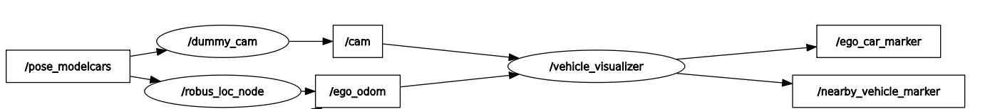

# Vehicle_Map
## Description
"The Vehicle_map component takes the pose information from localization component and the cam information from v2x_master component. It visualizes the pose of ego_car and nearby_vehicle in the rviz2 as a car model."
## Author
Vaithiyanathan Alagar
## Input

|**Topic** |**Message**| **Description**|
|------|-------|------------|
|/ego_odom |[/nav_msgs/msg/Odometry](https://docs.ros.org/en/noetic/api/nav_msgs/html/msg/Odometry.html) | Location of the ego_vehicle|
|/cam |[/v2x/msg/CAM](https://) | Location of Nearby vehicles|
|/path |[/M](https://) | Current path of the shuttle|
|/road_block |[/](https://) | Roadwork indication on the path|
## Function
Attaches visualization markers to represent the ego vehicle location from localization and the positions of nearby vehicles based on received CAM data.
## Output
|**Topic** |**Message**| **Description**|
|------|-------|------------|
|/ego_car_marker | [/visualization_msgs/Marker.msg](http://docs.ros.org/en/noetic/api/visualization_msgs/html/msg/Marker.html) | Marker to visualize the ego_vehicle position|
|/nearby_vehicle_marker | [/visualization_msgs/Marker.msg](http://docs.ros.org/en/noetic/api/visualization_msgs/html/msg/Marker.html) | Marker to visualize the nearby_vehicle position |
|/path | [/visualization_msgs/Marker.msg](http://docs.ros.org/en/noetic/api/visualization_msgs/html/msg/Marker.html) | Marker to visualize the current path in rviz2 |
|/road_block | [/visualization_msgs/Marker.msg](http://docs.ros.org/en/noetic/api/visualization_msgs/html/msg/Marker.html) | Marker to indicate the roadwork in current path |
## Instruction

Firstly for setting up the environment, Clone the robus_vehicle_map repository.

```
    https://git.hs-coburg.de/ROBUS/robus_vehicle_map.git

```
 Download the stl file from the below drive link. 

```
    https://drive.google.com/file/d/1FI5Rnu7rvhZUnChMeVYHjMYrgfuASkM9/view?usp=drive_link
```
 now give the path of the stl file in the script at the following line.

```
     m.mesh_resource = "file:///home/vaithish/v2x_ws/src/vehicle_map/models/car3.stl"
```
Next, build and source the files

```
    colcon build
    source install/setup.bash
```
In package terminal, we run the vehicle_map command for publishing the marker for ego_car Location and nearby_vehicle Location.

```
    ros2 run vehicle_map vehicle_map
```

In other terminal, we run the rviz2 for visualizing the marker for ego_car Location and nearby_vehicle Location.

```
    rviz2
```
The marker of the ego_car is published on the ego_car_marker topic. And the nearby_vehicle pose is published on the nearby_vehicle_marker topic.

### RQT node graph

<div align="center">
    
</div>

